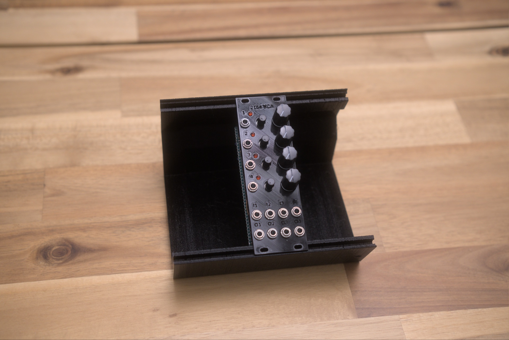

# Eurorack-2164-Quad-Exponential-VCA



A Eurorack Quad Exponential VCA based on the [AS2164](https://electricdruid.net/product/as2164-vca/) chip — four high-performance VCAs in a single PDIP-16 package, drop-in compatible with the SSI/SSM 2164 family. 120 dB control range, 0.07 dB channel-to-channel gain matching, and a single MODE pin that selects between Class A (low distortion, high idle current) and Class AB (low power, moderate distortion).

This design adds a **CV+manual offset per channel**, **bidirectional LED indicators**, **normalled signal chains** (Sig In 1 cascades to all unused inputs; CV In 1 cascades to all unused CV inputs), and a **Mix Output** that sums all four VCAs.

## Features

- **4 independent exponential VCAs** in one chip (AS2164 PDIP-16)
- **Normalled signal chain** — `Sig In 1 → Sig In 2 → Sig In 3 → Sig In 4` (an unplugged input draws from the previous one)
- **Normalled CV chain** — `CV1 → CV2 → CV3 → CV4` (one CV controls all unless overridden)
- **Per-channel CV attenuator + manual level pot** — combines patched CV with a panel-pot offset
- **Bidirectional LED indicators** showing CV level + polarity per channel
- **Mix Output** summing all four VCAs (via U5A + U5B)
- **Out 4 select jumper (JP1)** — Audio Out 4 jack outputs either VCA4 directly or the Mix Out
- **Class A operation** via MODE pin tied to +12V through 7.5 kΩ (R41) — datasheet's lowest-distortion choice
- Eurorack ±12V power via either 16-pin IDC or 3-pin JST connector

## Inputs and outputs

| Jack | Range | Notes |
|---|---|---|
| Sig In 1 | 10 Vpp (±5V) | Through 100K (Rin) to chip pin 2 (Iin1) |
| Sig In 2 | 10 Vpp | Same; normalled from Sig In 1 if unplugged |
| Sig In 3 | 10 Vpp | Normalled |
| Sig In 4 | 10 Vpp | Normalled |
| CV 1 | 0–5V | 0V = full attenuation, +5V = unity gain (at jack); inverted internally for chip's Vc polarity |
| CV 2 | 0–5V | Normalled from CV 1 |
| CV 3 | 0–5V | Normalled |
| CV 4 | 0–5V | Normalled |
| Audio Out 1 / 2 / 3 / 4 | 10 Vpp | Through transimpedance buffer (TL074) with 100K feedback |
| Audio Out 4 (alt) | 10 Vpp | JP1 selects between VCA4 direct or Mix Out |

Front-panel pots (per channel):

| Pot | Value | Function |
|---|---|---|
| RV1 / RV3 / RV5 / RV7 | 100K | **CV attenuator** — scales the CV jack signal |
| RV2 / RV4 / RV6 / RV8 | 50K | **Manual level** — fixed offset that adds to the CV input (lets the VCA pass signal with no CV patched) |

## Block diagram (per channel)

```
CV in jack ──┬── normalled to next channel
             │
             ▼
        [RV (100K) "CV atten" panel pot]
             │
             ▼
   −12V ──[RV (50K) "Manual level"]──[240K]──┐
                                              │
   [RV wiper] ─[100K]──┐                       │
                       ▼                       ▼
                  [TL074 inverting summer, 1M feedback]
                       │
                       ├──► [LED driver U1A→D1 bidirectional LED]
                       │
                       └──► [100K series]──► AS2164 Vc1 (chip pin 3, 6, 11, or 14)
                                          │
                                       [D8 / D9 BAT42 clamps to GND]

Sig in jack ──┬── normalled to next channel
              │
              ▼
         [100K Rin] ──► AS2164 Iin (chip pin 2, 7, 10, or 15)
                       │
                    [470pF compensation to GND]

AS2164 Iout (chip pin 4, 5, 12, or 13) ──► [TL074 transimpedance, 100K feedback, 100pF compensation]──► [470R + 1K series]──► output jack
                                            │
                                       Audio Out 1 / 2 / 3 / 4

AS2164 power (chip pins 1, 8, 9, 16):
  Pin 1  MODE ──[R41 = 7.5 kΩ]── +12V  (Class A operation — datasheet's lowest-distortion mode)
  Pin 8  GND  ── GND
  Pin 9  VEE  ── −12V
  Pin 16 VCC  ── +12V
  D5 BAT42 Schottky on power input — protects chip during power sequencing (per datasheet feature)

Mix Out: Audio Out 1..4 ──[R42–R45 = 100K each]── U5A inverting summer (R46 = 100K fb) ── U5B unity inverter (10K + 10K) ── R39 (1K) ── JP1 ── J12 Audio Out 4
                                                                                            (rev 0.1.4 dropped these from 100K to 10K for impedance/noise)
```

## Power

- Eurorack ±12V via **J13** (3-pin JST) or **J14** (16-pin IDC) — populate one
- D6 / D7: reverse-polarity protection diodes (silkscreen note: "Reverse polarity diodes required for AS2164")
- D5: Schottky on the chip's power input (silkscreen note: "Schottky diode required for AS2164")
- C15 / C19 (22 µF): bulk rail decoupling
- C13 / C14 / C16 / C17 / C18 / C20 (100 nF): supply decoupling on each op-amp and on the AS2164's VCC / VEE
- **R41 = 7.5 kΩ — MODE pin bias** — sets the chip to Class A operation per the AS2164 datasheet (`RB = 7.5K` for Class A, `OPEN` for Class AB)

AS2164 supply range is **±4V to ±18V** per datasheet, so the chip is happy at Eurorack ±12V with no current limiter needed on VEE (unlike the AS3310 / AS3330, which have internal Zeners requiring REE).

## Calibration

This module has no internal trim pots — operation is set by component values alone. The eight front-panel pots (four CV attenuators + four manual levels) are runtime controls.

**Verification procedure** (after build, with module warmed up ~5 min):

1. Probe ±12V rails — should read within ±5% of nominal
2. Probe the AS2164 MODE pin (pin 1) — should sit at ~+11.4V (12V minus a couple Vbe drops through R41)
3. With no CV patched and no signal patched:
   - Audio Out 1 / 2 / 3 / 4 should sit at GND ± a few mV (chip output offset)
   - LED indicators should be off (or very dim)
4. Patch a 1 kHz, 0.5 Vpp signal into Sig In 1 (which normals to all 4 channels)
5. Patch a stable +5V (e.g., from another module's +5V output) into CV 1 (which normals to all 4 channels)
6. All four Audio Out jacks should show ~0.5 Vpp at 1 kHz (unity gain)
7. Sweep the CV (or each channel's manual-level pot) — output should sweep cleanly from silence to unity, with bidirectional LED tracking

If channels have different gain at unity, see [issue #1](../../issues) — that's the channel-matching spec at ±0.07 dB (datasheet), so any audible mismatch points to a layout / component-value problem.

## Design notes

### Component-value choices vs the datasheet

The AS2164 datasheet's Typical Application Circuit (Figure 2) uses these reference values:

| Value | Datasheet Fig 2 | This design | Trade-off |
|---|---|---|---|
| Rin (signal series) | 30 kΩ | **100 kΩ** | 3.3× higher impedance — slightly noisier, but matches Rf for unity gain |
| Iin compensation | 500 Ω + 560 pF to GND | 100 pF only | Datasheet's 500 Ω damper is missing — may be worth adding (see #issue) |
| Rf (transimpedance) | 30 kΩ + 100 pF | **100 kΩ + 470 pF** | Matched to Rin; 470 pF is a more aggressive output low-pass |
| Vc series resistor | direct (or 30K in many app circuits) | **100 kΩ** | Gives ~110 mV/dB external CV scale (datasheet 33 mV/dB at 30K) — a more musical V/dB ratio for Eurorack |
| MODE pin | 7.5 kΩ to V+ for Class A | 7.5 kΩ to +12V | ✓ matches datasheet for Class A |
| V+ / V− bypass | 0.1 µF each | 22 µF bulk + 100 nF | More aggressive decoupling, good practice |

The `Rin = Rf = 100K` choice gives unity gain (Vout = Vin) at Vc = 0V. The datasheet's 30K + 30K would give ~0.74× attenuation due to the chip's internal 10.5 kΩ — so Rex's 100K choice is *closer to true unity gain at the audio path* than the datasheet's reference values.

### Vc scaling math

With external Vc series resistor `R7 = 100 kΩ` and the AS2164's −33 mV/dB internal scale (at the datasheet-reference 30 kΩ), the **external CV-to-dB ratio** scales by the resistance ratio:

`External scale = 33 mV/dB × (100K / 30K) ≈ 110 mV/dB at the CV input pin`

This means:
- 1V CV change ≈ 9 dB gain change
- 3V CV swing ≈ 27 dB attenuation (audible but not "full mute")
- 9V CV swing ≈ 82 dB attenuation (effectively muted)

The schematic's note "3.3V = 100% attenuation" is informal — at 3.3V you get ~30 dB, which is "very quiet" but not literally −∞. Full datasheet-spec mute (−90 to −110 dB) needs ~9–11V at the external Vc pin.

For this design's Eurorack CV path (0–5V jack → inverter U1A → 100K series → chip Vc), the practical attenuation range is wide enough for musical use.

## References

Local archived copies live in [`references/`](references/) so this repo stays useful if the upstream links die.

- **AS2164 datasheet** — [local copy](references/AS2164-alfatriode-2020.pdf) · [upstream (alfatriode.lv)](https://alfatriode.lv/eng/sc/AS2164.pdf)
- **SSI2164 datasheet** — [local copy](references/SSI2164-amazingsynth.pdf) · [upstream](https://www.amazingsynth.com/parts/ssi2164/ssi2164-datasheet.pdf) — drop-in compatible chip, more thorough application notes than AS2164
- **SSM2164 datasheet (Analog Devices)** — [upstream](https://www.analog.com/media/en/technical-documentation/data-sheets/SSM2164.pdf) — analog.com blocks direct curl; save manually if you want a local archive
- [Electric Druid AS2164 product page](https://electricdruid.net/product/as2164-vca/)
- Design inspiration: [Hagiwo V2164 Dual VCA](https://note.com/solder_state/n/n14a8be5f7118) (Japanese; page is JS-rendered, save manually for offline)
- Design inspiration: [Intellijel Quad VCA](https://intellijel.com/shop/eurorack/quad-vca/)

## Build status

What's ready for builders today, and what's still on the TODO list:

**Production assets** (what you need to actually fabricate and assemble a final unit)

- [x] Schematic — Rev 0.1.4 ([Eurorack-2164-Quad-Exponential-VCA-Schematic-Rev0.1.4.pdf](Schematic%20PDFs/Eurorack-2164-Quad-Exponential-VCA-Schematic-Rev0.1.4.pdf))
- [ ] PCB layout — in progress — single working layout in `kicad/`, not yet separated for fab
- [ ] Gerber files for fabrication — none yet
- [ ] BOM — none yet
- [ ] Final front panel (SVG/PDF for fab) — none yet
- [ ] License — none yet

**Prototype assets** (for breadboard / perfboard / 3D-printed-panel builds before final PCB)

- [x] 3D-printed prototype panel STL — [2164_Quad_VCA.stl](3D%20printed%20front%20panel/2164_Quad_VCA.stl)
- [x] Falstad simulations — [falstad/](falstad/)

**Documentation**

- [x] Photos of the assembled module — see [photos/](photos/)
- [ ] Demo video — none yet
- [ ] Build / assembly instructions — none yet
- [x] Verification procedure — see Calibration section above

Want to help fill a gap (build photos, gerbers, an assembly guide)? Open an issue or PR.
